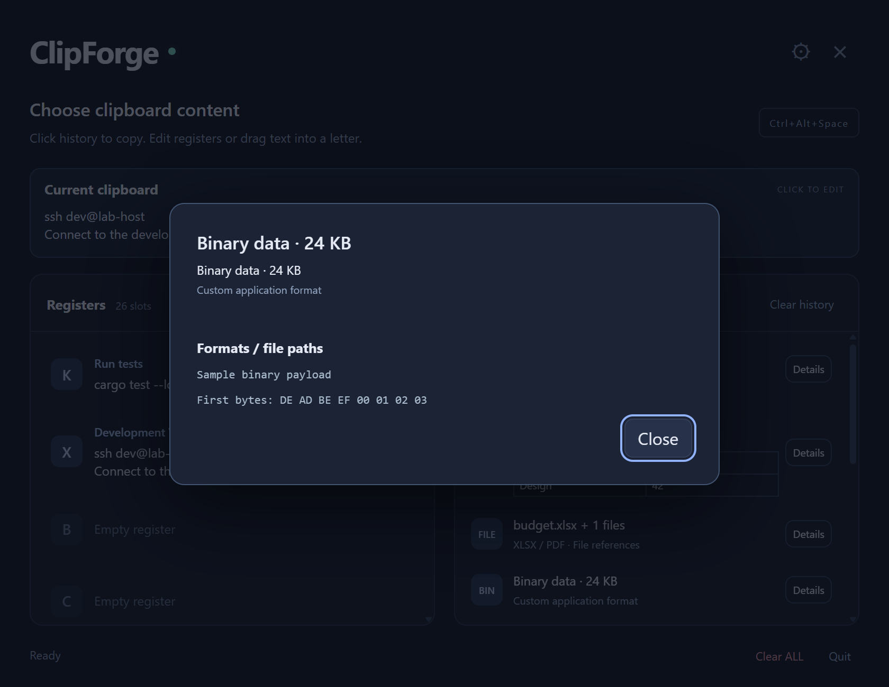

<p align="center"></p>
<h1 align="center">ClipForge</h1>
<p align="center">Your useful text, one letter away.</p>

ClipForge is a Rust + Tauri clipboard manager that lives in your system tray. Keep reusable text in **26 named registers (A–Z)** and recover **100 recent clipboard entries**. Windows history supports text, images, file references, spreadsheet cells, and memory-backed binary formats.


## Install

Download `clipforge.exe` from [Releases](https://github.com/Pline-0x8/ClipForge/releases), put it in a permanent folder, and run it. Windows requires Microsoft WebView2 Runtime. Click the tray icon or press **Ctrl+Alt+Space** to open the picker.

For startup at login, place a shortcut to the executable in your Windows Startup folder (`Win+R` → `shell:startup`).

## Use it

| Default shortcut | Action |
| --- | --- |
| Ctrl+Alt+Space | Open / hide the picker |
| Ctrl+Alt+C, release C, then A–Z | Copy selected text into a register (Windows) |
| Ctrl+Alt+V, release V, then A–Z | Paste a register (Windows) |
| Arrows / Tab, then Enter | Load a highlighted entry and close |
| Escape | Cancel an edit or close the picker |

Press the register letter within two seconds. Release modifiers to allow native Copy/Paste. Ordinary Ctrl+C/V keeps working.

- **Save:** drag text history onto a register, or use **Save current…** for clipboard text. Registers remain text-only.
- **Load:** click a history entry to restore its clipboard content, then hide and paste normally. Arrows / Tab and Enter also work with mixed history.
- **Inspect:** **Details** shows format names, file paths, and a short hex sample for non-text entries. Click a non-text current clipboard preview to inspect it.
- **Edit:** click a register, name it, and change its multiline text. **Submit** or click elsewhere to save; Escape cancels.
- **Customize:** use the gear to change hotkeys. Settings persist; conflicts retain the previous configuration.
- **Clear:** trash clears one register. **Clear registers** in the Registers panel clears all register text and names while keeping history and the current clipboard. **Clear history** in the History panel removes recent copies while keeping registers and the current clipboard. **Clear ALL** at the bottom clears both panels and the host clipboard.


*Screenshots show the actual frontend in Chrome with sample data, without accessing the host clipboard.*

## Clipboard previews on Windows

| Copied content | History preview |
| --- | --- |
| Text | Two-line text preview |
| Image | Thumbnail and dimensions for PNG and common 24/32-bit DIB images; other image encodings show an image label |
| Files, including Excel files and PDFs | Filename and number of files; Details lists paths. PDFs are not rendered as first-page thumbnails |
| Spreadsheet cells | Small table from tab-separated text, with captured workbook/HTML formats retained for pasting |
| Unknown binary format | Type and size label; format names and the first 16 bytes in Details |



File entries store **references**, not backups: source files must still exist when you paste. Restored file entries use copy semantics, even if originally cut. History preserves supported memory-backed Windows clipboard formats; process-specific OLE objects, virtual files, and GDI/metafile handles are not retained. Applications may require formats that cannot be captured, so native Excel/OLE fidelity is not guaranteed. Preview labels are never pasted in place of the original bytes.

## Know before you use it

- Register text is limited to **1 MiB per entry**. Unicode and whitespace are preserved. Windows rich entries are limited to **32 MiB** of captured format data each, with a **128 MiB** history payload budget; older entries are evicted as needed.
- Registers, names, and history stay in memory and disappear on exit. Only hotkeys are saved to disk.
- Windows has global letter shortcuts and rich clipboard history. macOS/X11 use a register chooser and text-only history; Wayland supports manual clipboard actions only. macOS/Linux runtime behavior remains unverified here.
- Windows cannot paste into elevated apps from a lower-integrity process. VM clipboard sharing depends on guest tools.

## Build and develop

Install stable Rust and [Tauri's native prerequisites](https://v2.tauri.app/start/prerequisites/). On Windows:

```powershell
git clone https://github.com/Pline-0x8/ClipForge.git
cd ClipForge
cargo build --release --locked
.\target\release\clipforge.exe
```

Use `--show` to open the picker immediately. No npm install or frontend build is required.

```powershell
cargo test --locked --all-targets
cargo clippy --locked --all-targets -- -D warnings
node tests/ui.test.cjs
```

See [Development](docs/DEVELOPMENT.md) for cleanup and commands, [Testing](TESTING.md) for native validation, and [Artwork](docs/ARTWORK.md) for the icon and screenshot workflows.

[MIT license](LICENSE)
