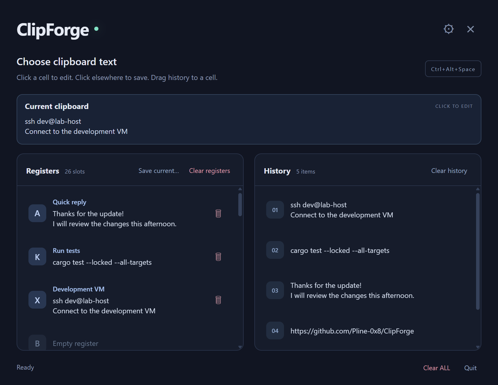
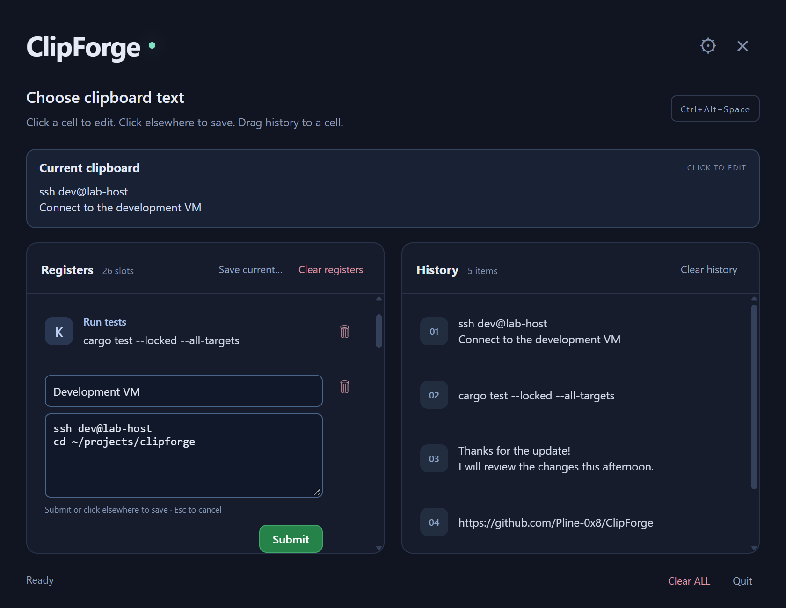

<p align="center"></p>
<h1 align="center">ClipForge</h1>
<p align="center">Your useful text, one letter away.</p>

ClipForge is a Rust + Tauri clipboard manager that lives in your system tray. Keep reusable snippets in **26 named registers (A–Z)** and recover text from **100 unique recent copies**.



## Install

Download `clipforge.exe` from [Releases](https://github.com/Pline-0x8/ClipForge/releases), put it in a permanent folder, and run it. Windows requires Microsoft WebView2 Runtime. Click the tray icon or press **Ctrl+Alt+Space** to open the picker.

For startup at login, place a shortcut to the executable in your Windows Startup folder (`Win+R` → `shell:startup`).

## Use it

| Default shortcut | Action |
| --- | --- |
| Ctrl+Alt+Space | Open / hide the picker |
| Ctrl+Alt+C, release C, then A–Z | Copy selected text into a register (Windows) |
| Ctrl+Alt+V, release V, then A–Z | Paste a register (Windows) |
| Arrows / Tab, then Enter | Load a highlighted entry and close |
| Escape | Cancel an edit or close the picker |

Press the register letter within two seconds. Release modifiers to allow native Copy/Paste. Ordinary Ctrl+C/V keeps working.

- **Save:** drag history onto a register, or use **Save current…** after copying normally.
- **Load:** click history to put its full text on the clipboard, then hide and paste normally.
- **Edit:** click a register, name it, and change its multiline text. **Submit** or click elsewhere to save; Escape cancels.
- **Customize:** use the gear to change hotkeys. Settings persist; conflicts retain the previous configuration.
- **Clear:** trash clears one register. **Clear registers** in the Registers panel clears all register text and names while keeping history and the current clipboard. **Clear history** in the History panel removes recent copies while keeping registers and the current clipboard. **Clear ALL** at the bottom clears both panels and the host clipboard.



*Screenshots show the actual frontend in Chrome with sample data, without accessing the host clipboard.*

## Know before you use it

- Plain text only, up to **1 MiB per entry**. Unicode and whitespace are preserved.
- Registers, names, and history stay in memory and disappear on exit. Only hotkeys are saved to disk.
- Windows has global letter shortcuts. macOS/X11 use a register chooser; Wayland supports manual clipboard actions only. macOS/Linux runtime behavior remains unverified here.
- Windows cannot paste into elevated apps from a lower-integrity process. VM clipboard sharing depends on guest tools.

## Build and develop

Install stable Rust and [Tauri's native prerequisites](https://v2.tauri.app/start/prerequisites/). On Windows:

```powershell
git clone https://github.com/Pline-0x8/ClipForge.git
cd ClipForge
cargo build --release --locked
.\target\release\clipforge.exe
```

Use `--show` to open the picker immediately. No npm install or frontend build is required.

```powershell
cargo test --locked --all-targets
cargo clippy --locked --all-targets -- -D warnings
node tests/ui.test.cjs
```

See [Development](docs/DEVELOPMENT.md) for cleanup and commands, [Testing](TESTING.md) for native validation, and [Artwork](docs/ARTWORK.md) for the icon and screenshot workflows.

[MIT license](LICENSE)
